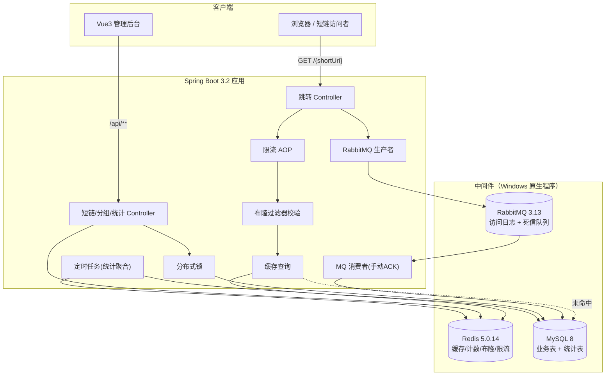
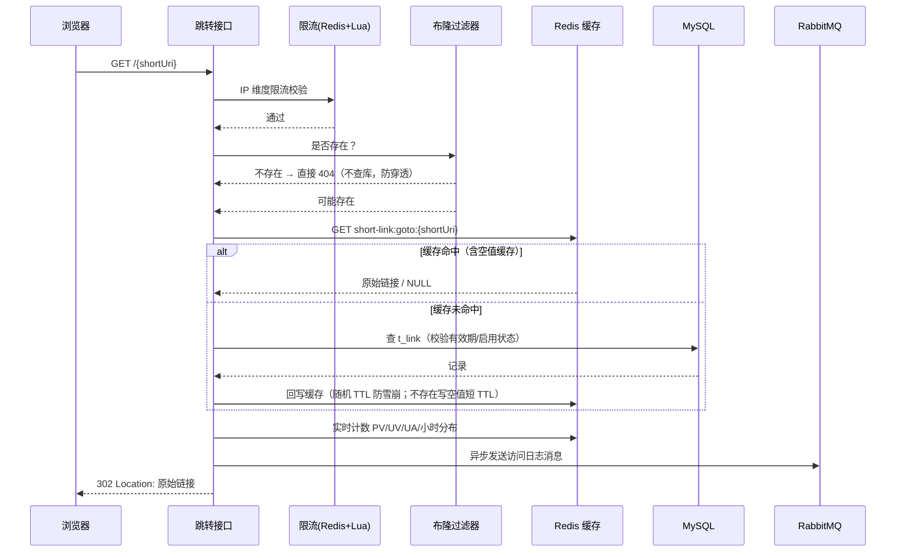

# 分布式短链接系统 · 开发文档

> 面向：大三学生 / 面试简历项目
> 周期：4 周
> 环境：本机开发（Windows，不做虚拟化）→ 后期部署到 2 核 2G Windows 服务器（中间件全部 Windows 原生程序）

---

## 目录

1. [项目定位与简历卖点](#1-项目定位与简历卖点)
2. [需求分析](#2-需求分析)
3. [技术架构](#3-技术架构)
4. [数据库设计](#4-数据库设计)
5. [Redis Key 设计](#5-redis-key-设计)
6. [接口设计](#6-接口设计)
7. [核心技术方案（面试重点）](#7-核心技术方案面试重点)
8. [工程骨架与配置](#8-工程骨架与配置)
9. [四周开发排期（独立文档）](./short-link-开发排期.md)
10. [测试与压测方案](#10-测试与压测方案)
11. [Windows 服务器部署方案](#11-windows-服务器部署方案)
12. [风险清单与规避](#12-风险清单与规避)
13. [简历包装与面试问答](#13-简历包装与面试问答)

---

## 1. 项目定位与简历卖点

### 1.1 一句话定位

一个 **分布式短链接生成与访问统计系统**：把长 URL 压缩成 6 位短链，提供 302 跳转、分组管理、有效期控制、实时访问统计与可视化看板。

### 1.2 为什么选短链项目

| 优势 | 说明 |
| --- | --- |
| 业务足够简单 | 三个核心动作：**创建、跳转、统计**，不需要懂复杂业务规则，全部精力放在技术深度上 |
| 天然高并发 | 跳转接口是典型的"读多写少 + 极低延迟"场景，缓存、布隆、限流、异步全部有真实用武之地 |
| 面试可深挖 | Base62 编码、缓存穿透/击穿/雪崩、分布式锁、幂等、消息可靠性、HyperLogLog 基数统计，每个都是高频考点 |
| 演示直观 | 浏览器输入短链接就能跳转，看板有图表，比 CRUD 后台更容易在面试中讲清楚 |

### 1.3 简历卖点（4 个技术亮点，四选四全做）

1. **缓存三件套**：Redis 缓存跳转 + Redisson 布隆过滤器防穿透 + 空值缓存，跳转 QPS 从 200 提升到 3000+（实测填真实数据）
2. **限流防刷**：Redis + Lua 滑动窗口，按 IP/用户维度限流，防止短链被恶意刷量
3. **分布式锁与幂等**：Redisson 看门狗锁保证同一长链重复创建返回同一短链，唯一索引兜底
4. **异步与可靠性**：RabbitMQ 访问日志异步落库 + 手动 ACK + 消费幂等 + 死信队列，跳转接口不因落库耗时

---

## 2. 需求分析

### 2.1 功能需求

#### 用户端（面向使用者）

| 编号 | 功能 | 说明 |
| --- | --- | --- |
| F1 | 用户注册 | 用户名 + 密码（BCrypt 加密），用户名唯一校验 |
| F2 | 用户登录 / 登出 | Sa-Token 签发 token，存 Redis |
| F3 | 分组管理 | 新建/重命名/删除分组，分组内短链数量统计 |
| F4 | 创建短链 | 支持**单个**与**批量**创建；支持系统随机后缀或**自定义后缀**；支持设置有效期（永久/自定义截止时间） |
| F5 | 短链管理 | 分页列表（按分组、关键词、时间范围筛选）、编辑（描述/有效期/分组）、启用禁用、删除 |
| F6 | 短链跳转 | 访问 `http://域名/{短链}` 或 `http://域名/{分组}/{短链}` → 302 重定向到原始链接；短链不存在或已过期 → 404 页面 |
| F7 | 访问统计看板 | 单条短链 / 全部分组：PV、UV、UIP、24 小时访问分布、近 N 天趋势、浏览器/操作系统/设备类型/地区占比 |
| F8 | 访问明细 | 分页查看访问日志（时间、IP、浏览器、OS、设备、地区） |

#### 管理端

本次不做多角色权限，**用户即管理者**（自己的短链自己管理），通过 Sa-Token 拦截器保证越权访问被拒绝（分组归属校验）。这一点面试时也要主动说明"为什么不做 RBAC 而做数据隔离"。

### 2.2 非功能需求

| 维度 | 目标 | 验证方式 |
| --- | --- | --- |
| 跳转性能 | 缓存命中时 RT < 20ms，单机 QPS ≥ 3000（本地 8C16G 压测） | JMeter 压测报告 |
| 创建性能 | QPS ≥ 500，且高并发下不产生重复短链 | JMeter 并发创建同一长链 |
| 可用性 | 短链不存在时不查数据库（布隆过滤器拦截） | 日志/Redis 监控证明 |
| 数据可靠性 | MQ 消费异常进入死信队列，消息不丢 | 手动制造异常消息验证 |
| 统计准确性 | 看板 PV 与明细表记录数误差为 0；UV 误差 ≤ 1%（HyperLogLog 标准误差 0.81%） | 对比校验脚本 |
| 安全 | 密码 BCrypt、token 鉴权、越权校验、接口限流 | 接口测试 |

### 2.3 明确不做（避免范围蔓延）

- 不做分库分表（`t_link_goto` 表预留设计但可不启用；如四周有余力再作为进阶）
- 不做 RBAC 权限模型
- 不做短链防盗链 / 密码访问
- 不做多租户 SaaS 化

---

## 3. 技术架构

### 3.1 技术栈

| 技术 | 版本 | 用途 | 选型理由 |
| --- | --- | --- | --- |
| JDK | 17 | 运行时 | Spring Boot 3.x 最低要求，LTS |
| Spring Boot | 3.2.x | 基础框架 | 主流版本，Web/Validation/AMQP 全家桶 |
| Spring MVC | 3.2.x | 三层架构对外接口 | 需求指定 |
| MyBatis-Plus | 3.5.7 | 持久层 | 单表 CRUD 零 SQL、分页插件、逻辑删除、字段自动填充；复杂 SQL 手写在 XML |
| MySQL | 8.x（本机 8.4） | 业务数据 | 映射表 + 日志表 |
| Redis | 5.0.14（Windows） | 缓存 / 计数器 / 布隆 / 限流 | 本项目用到的命令 Redis 5.0 全部支持 |
| Redisson | 3.27.x | 分布式锁 / 布隆过滤器 | 带看门狗自动续期，比自己写 SETNX + Lua 更靠谱 |
| RabbitMQ | 3.13.x | 访问日志异步落库 | 轻量、本地好部署、支持死信队列 |
| Sa-Token | 1.37.0 | 登录鉴权 | 比 Spring Security 简单得多，两天内能搞定鉴权 |
| Knife4j | 4.5.0 | 接口文档 | OpenAPI3 + 在线调试 UI |
| Hutool | 5.8.x | 工具类 | `UserAgentUtil` 解析浏览器/OS、IP 工具、摘要 |
| EasyExcel | 3.3.x | 导出（可选） | 访问明细分页导出 |
| Lombok | 1.18.x | 简化实体 | — |
| JUnit5 + Mockito | — | 单测 | 核心 Service 单测 |
| Vue3 + Vite + Element Plus + ECharts | — | 管理页 | AI 辅助生成，5 个页面 |
| Nginx for Windows | — | 前端托管 + 反向代理 | 服务器上原生运行 |

**版本兼容性注意（踩坑预警）**

- MyBatis-Plus 3.5.7 配合 Spring Boot 3 必须用 `mybatis-plus-spring-boot3-starter`，用错 starter 会启动报错
- Knife4j 4.5.0 配合 Spring Boot 3 必须用 `knife4j-openapi3-jakarta-spring-boot-starter`
- RabbitMQ 3.13 需要 Erlang/OTP 26.x，Windows 安装顺序：**先 Erlang 再 RabbitMQ**
- Redis 5.0.14 Windows 版（tporadowski 移植版）不支持 `RedisJSON`、`RedisSearch` 等模块，本方案已规避
- Spring Boot 3.2 默认开启虚拟线程需 JDK21，本项目 JDK17 不涉及

### 3.2 系统架构



### 3.3 跳转链路时序（核心链路，面试必讲）



### 3.4 包结构（单体分包，够用且清晰）

```
com.xxx.shortlink
├── ShortLinkApplication.java
├── common
│   ├── annotation      // @RateLimit 等自定义注解
│   ├── aspect          // 限流、日志 AOP
│   ├── config          // MyBatis-Plus / Redis / Redisson / RabbitMQ / Knife4j / Sa-Token 配置
│   ├── constant        // RedisKeyConstant、MQConstant
│   ├── enums           // 有效期类型、启用状态、返回码
│   ├── exception       // BizException + 全局异常处理器
│   └── result          // Result<T>、PageResult<T>
├── controller
├── service / service.impl
├── dao / mapper        // Mapper 接口 + resources/mapper/*.xml
├── entity / dto / vo
├── mq                  // 生产者、消费者、消息体
├── job                 // 定时任务
├── util                // Base62、HashUtil、UA 解析、IP 获取
└── filter / interceptor
```

---

## 4. 数据库设计

### 4.1 建表顺序

`t_user` → `t_group` → `t_link` → `t_link_goto`（可选）→ `t_link_access_logs`（明细）→ 6 张统计表。

### 4.2 DDL

```sql
CREATE DATABASE IF NOT EXISTS short_link DEFAULT CHARACTER SET utf8mb4 COLLATE utf8mb4_general_ci;
USE short_link;

-- ---------- 用户表 ----------
CREATE TABLE t_user (
    id            BIGINT UNSIGNED NOT NULL AUTO_INCREMENT COMMENT '主键',
    username      VARCHAR(64)  NOT NULL COMMENT '用户名',
    password      VARCHAR(100) NOT NULL COMMENT '密码（BCrypt）',
    real_name     VARCHAR(64)           DEFAULT NULL COMMENT '真实姓名',
    phone         VARCHAR(20)           DEFAULT NULL COMMENT '手机号',
    mail          VARCHAR(64)           DEFAULT NULL COMMENT '邮箱',
    deletion_time BIGINT                DEFAULT 0 COMMENT '注销时间戳',
    create_time   DATETIME     NOT NULL DEFAULT CURRENT_TIMESTAMP COMMENT '创建时间',
    update_time   DATETIME     NOT NULL DEFAULT CURRENT_TIMESTAMP ON UPDATE CURRENT_TIMESTAMP COMMENT '修改时间',
    del_flag      TINYINT      NOT NULL DEFAULT 0 COMMENT '删除标识 0正常 1删除',
    PRIMARY KEY (id),
    UNIQUE KEY uk_username (username)
) ENGINE = InnoDB COMMENT ='用户表';

-- ---------- 分组表 ----------
CREATE TABLE t_group (
    id          BIGINT UNSIGNED NOT NULL AUTO_INCREMENT COMMENT '主键',
    gid         VARCHAR(32)  NOT NULL COMMENT '分组标识',
    name        VARCHAR(64)  NOT NULL COMMENT '分组名称',
    username    VARCHAR(64)  NOT NULL COMMENT '所属用户',
    sort_order  INT          NOT NULL DEFAULT 0 COMMENT '排序',
    create_time DATETIME     NOT NULL DEFAULT CURRENT_TIMESTAMP,
    update_time DATETIME     NOT NULL DEFAULT CURRENT_TIMESTAMP ON UPDATE CURRENT_TIMESTAMP,
    del_flag    TINYINT      NOT NULL DEFAULT 0,
    PRIMARY KEY (id),
    UNIQUE KEY uk_gid (gid),
    KEY idx_username (username)
) ENGINE = InnoDB COMMENT ='短链分组表';

-- ---------- 短链表 ----------
CREATE TABLE t_link (
    id              BIGINT UNSIGNED NOT NULL AUTO_INCREMENT COMMENT '主键',
    domain          VARCHAR(128)          DEFAULT NULL COMMENT '域名',
    short_uri       VARCHAR(16)           DEFAULT NULL COMMENT '短链后缀（Base62）',
    full_short_url  VARCHAR(128)          DEFAULT NULL COMMENT '完整短链',
    origin_url      VARCHAR(512)  NOT NULL COMMENT '原始链接',
    origin_url_hash CHAR(32)      NOT NULL COMMENT 'MD5(origin_url)，用于唯一索引',
    click_num       INT          NOT NULL DEFAULT 0 COMMENT '累计点击次数',
    gid             VARCHAR(32)  NOT NULL DEFAULT 'default' COMMENT '分组标识',
    enable_status   TINYINT      NOT NULL DEFAULT 0 COMMENT '0启用 1禁用',
    created_type    TINYINT      NOT NULL DEFAULT 0 COMMENT '0接口 1控制台',
    valid_date_type TINYINT      NOT NULL DEFAULT 0 COMMENT '有效期类型 0永久 1自定义',
    valid_date      DATETIME              DEFAULT NULL COMMENT '失效时间',
    description     VARCHAR(255)          DEFAULT NULL COMMENT '备注',
    create_time     DATETIME     NOT NULL DEFAULT CURRENT_TIMESTAMP,
    update_time     DATETIME     NOT NULL DEFAULT CURRENT_TIMESTAMP ON UPDATE CURRENT_TIMESTAMP,
    del_flag        TINYINT      NOT NULL DEFAULT 0,
    PRIMARY KEY (id),
    -- 幂等核心：同一分组下同一长链只允许一条有效记录（MySQL 原生幂等兜底）
    UNIQUE KEY uk_gid_origin (gid, origin_url_hash),
    UNIQUE KEY uk_short_uri (gid, short_uri),
    KEY idx_create_time (create_time),
    KEY idx_full_short_url (full_short_url)
) ENGINE = InnoDB COMMENT ='短链表';

-- ---------- 跳转表（高并发拆分预留，四周时间紧可先不启用）----------
-- 设计意图：把「写多读少的管理信息」和「读多写少的跳转信息」拆开，
-- 跳转只查这张小表，避免 t_link 宽表 + 二级索引的影响。面试可讲。
CREATE TABLE t_link_goto (
    id             BIGINT UNSIGNED NOT NULL AUTO_INCREMENT,
    full_short_url VARCHAR(128) NOT NULL COMMENT '完整短链',
    gid            VARCHAR(32)  NOT NULL COMMENT '分组标识',
    origin_url     VARCHAR(512) NOT NULL COMMENT '原始链接',
    PRIMARY KEY (id),
    UNIQUE KEY uk_full_short_url (full_short_url)
) ENGINE = InnoDB COMMENT ='短链跳转表';

-- ---------- 访问日志明细表 ----------
CREATE TABLE t_link_access_logs (
    id             BIGINT UNSIGNED NOT NULL AUTO_INCREMENT,
    msg_id         VARCHAR(64)  NOT NULL COMMENT 'MQ 消息唯一 ID（消费幂等）',
    link_id        BIGINT UNSIGNED       DEFAULT NULL COMMENT '短链 ID',
    full_short_url VARCHAR(128) NOT NULL COMMENT '完整短链',
    gid            VARCHAR(32)           DEFAULT NULL,
    short_uri      VARCHAR(16)           DEFAULT NULL,
    user           VARCHAR(64)           DEFAULT NULL COMMENT '访问者标识（uv 去重键）',
    ip             VARCHAR(64)           DEFAULT NULL COMMENT '访问 IP',
    browser        VARCHAR(64)           DEFAULT NULL COMMENT '浏览器',
    os             VARCHAR(64)           DEFAULT NULL COMMENT '操作系统',
    device_type    VARCHAR(32)           DEFAULT NULL COMMENT '设备类型',
    locale         VARCHAR(64)           DEFAULT NULL COMMENT '地区（本项目按 IP 段/浏览器语言粗粒度）',
    access_time    DATETIME     NOT NULL COMMENT '访问时间',
    create_time    DATETIME     NOT NULL DEFAULT CURRENT_TIMESTAMP,
    PRIMARY KEY (id),
    UNIQUE KEY uk_msg_id (msg_id),
    KEY idx_full_short_url_time (full_short_url, access_time),
    KEY idx_gid_time (gid, access_time)
) ENGINE = InnoDB COMMENT ='访问日志明细表';
-- 注意：这是唯一会持续膨胀的表。第 3 周加一个定时任务清理 90 天前的数据。

-- ---------- 统计表（按天，定时任务覆盖写入，天然幂等）----------
CREATE TABLE t_link_access_stats (
    id             BIGINT UNSIGNED NOT NULL AUTO_INCREMENT,
    full_short_url VARCHAR(128) NOT NULL,
    date           DATE         NOT NULL COMMENT '统计日期',
    pv             INT          NOT NULL DEFAULT 0 COMMENT '访问量',
    uv             INT          NOT NULL DEFAULT 0 COMMENT '独立访客(HyperLogLog)',
    uip            INT          NOT NULL DEFAULT 0 COMMENT '独立 IP(HyperLogLog)',
    create_time    DATETIME     NOT NULL DEFAULT CURRENT_TIMESTAMP,
    update_time    DATETIME     NOT NULL DEFAULT CURRENT_TIMESTAMP ON UPDATE CURRENT_TIMESTAMP,
    PRIMARY KEY (id),
    UNIQUE KEY uk_full_short_url_date (full_short_url, date)
) ENGINE = InnoDB COMMENT ='短链访问统计表';

CREATE TABLE t_link_access_hour_stats (
    id             BIGINT UNSIGNED NOT NULL AUTO_INCREMENT,
    full_short_url VARCHAR(128) NOT NULL,
    date           DATE         NOT NULL,
    hour_00        INT NOT NULL DEFAULT 0, hour_01 INT NOT NULL DEFAULT 0,
    hour_02        INT NOT NULL DEFAULT 0, hour_03 INT NOT NULL DEFAULT 0,
    hour_04        INT NOT NULL DEFAULT 0, hour_05 INT NOT NULL DEFAULT 0,
    hour_06        INT NOT NULL DEFAULT 0, hour_07 INT NOT NULL DEFAULT 0,
    hour_08        INT NOT NULL DEFAULT 0, hour_09 INT NOT NULL DEFAULT 0,
    hour_10        INT NOT NULL DEFAULT 0, hour_11 INT NOT NULL DEFAULT 0,
    hour_12        INT NOT NULL DEFAULT 0, hour_13 INT NOT NULL DEFAULT 0,
    hour_14        INT NOT NULL DEFAULT 0, hour_15 INT NOT NULL DEFAULT 0,
    hour_16        INT NOT NULL DEFAULT 0, hour_17 INT NOT NULL DEFAULT 0,
    hour_18        INT NOT NULL DEFAULT 0, hour_19 INT NOT NULL DEFAULT 0,
    hour_20        INT NOT NULL DEFAULT 0, hour_21 INT NOT NULL DEFAULT 0,
    hour_22        INT NOT NULL DEFAULT 0, hour_23 INT NOT NULL DEFAULT 0,
    create_time    DATETIME NOT NULL DEFAULT CURRENT_TIMESTAMP,
    update_time    DATETIME NOT NULL DEFAULT CURRENT_TIMESTAMP ON UPDATE CURRENT_TIMESTAMP,
    PRIMARY KEY (id),
    UNIQUE KEY uk_full_short_url_date (full_short_url, date)
) ENGINE = InnoDB COMMENT ='24 小时访问分布';

-- 维度统计表：结构一致，以 browser 为例，另建 t_link_os_stats / t_link_device_stats / t_link_locale_stats
CREATE TABLE t_link_browser_stats (
    id             BIGINT UNSIGNED NOT NULL AUTO_INCREMENT,
    full_short_url VARCHAR(128) NOT NULL,
    date           DATE         NOT NULL,
    browser        VARCHAR(64)  NOT NULL COMMENT '浏览器名',
    cnt            INT          NOT NULL DEFAULT 0,
    create_time    DATETIME     NOT NULL DEFAULT CURRENT_TIMESTAMP,
    update_time    DATETIME     NOT NULL DEFAULT CURRENT_TIMESTAMP ON UPDATE CURRENT_TIMESTAMP,
    PRIMARY KEY (id),
    UNIQUE KEY uk_url_date_browser (full_short_url, date, browser)
) ENGINE = InnoDB COMMENT ='浏览器维度统计';
```

**设计说明（面试会被问）**

- `origin_url_hash` 用 MD5 而不是直接对 `origin_url` 建唯一索引：URL 可能超过 512 字符，且 utf8mb4 下长字段索引代价高；MD5 定长 32 字节，索引效率高。MD5 碰撞在此场景可忽略（不同长链 MD5 碰撞概率极低，且碰撞也只是合并两个短链，不是安全问题）。
- 幂等双保险：**唯一索引是最终一致性兜底，分布式锁是第一道防线**。数据库唯一冲突时捕获 `DuplicateKeyException`，改为查询已存在记录返回，而不是报错。
- 统计表用「定时任务覆盖写 + `ON DUPLICATE KEY UPDATE`」而非「每次访问累加」，避免热行更新争抢和 HLL 无法取增量的问题。

### 4.3 表关系

```
t_user 1 ──── n t_group 1 ──── n t_link 1 ──── n t_link_access_logs
                                     │
                                     └──────── n t_link_access_stats / *_hour_stats / *_browser_stats ...
```

---

## 5. Redis Key 设计

**命名规范**：`short-link:{模块}:{业务}:{标识}`，统一在 `RedisKeyConstant` 中定义，禁止硬编码。

| 用途 | Key 模板 | 类型 | 过期时间 | 说明 |
| --- | --- | --- | --- | --- |
| 跳转缓存 | `short-link:goto:{domain}:{shortUri}` | String | 1 天 + 随机 0~1h | 防雪崩；值为原始链接；空值写 `""` |
| 布隆过滤器 | `short-link:bloom-filter:{gid}` | Redisson RBloomFilter | 永久 | 期望插入量 1_000_000，误判率 0.01 |
| 分组短链集合 | `short-link:gid:set:{gid}` | Set | 1 天 | 生成短链时查重，避免同一分组后缀冲突 |
| PV 计数 | `short-link:stats:pv:{date}:{fullShortUrl}` | String（INCR） | 2 天 | |
| UV 基数 | `short-link:stats:uv:{date}:{fullShortUrl}` | HyperLogLog | 2 天 | `PFADD`，访问者标识 |
| UIP 基数 | `short-link:stats:uip:{date}:{fullShortUrl}` | HyperLogLog | 2 天 | `PFADD`，IP |
| 浏览器分布 | `short-link:stats:browser:{date}:{fullShortUrl}` | Hash | 2 天 | field=Chrome，value=次数 |
| OS 分布 | `short-link:stats:os:{date}:{fullShortUrl}` | Hash | 2 天 | |
| 设备分布 | `short-link:stats:device:{date}:{fullShortUrl}` | Hash | 2 天 | |
| 地区分布 | `short-link:stats:locale:{date}:{fullShortUrl}` | Hash | 2 天 | |
| 小时分布 | `short-link:stats:hour:{date}:{fullShortUrl}` | Hash | 2 天 | field=0~23 |
| 自定义后缀锁 | `short-link:lock:custom-uri:{gid}:{shortUri}` | Redisson 锁 | 看门狗 | 自定义后缀并发创建 |
| 创建幂等锁 | `short-link:lock:create:{gid}:{urlHash}` | Redisson 锁 | 看门狗 | 同一长链并发创建 |
| 定时任务锁 | `short-link:lock:job:{jobName}` | Redisson 锁 | 看门狗 | 多实例防重复执行 |
| 跳转限流 | `short-link:rate-limit:ip:{ip}` | ZSET | 窗口大小 | Lua 滑动窗口 |
| 创建限流 | `short-link:rate-limit:user:{username}` | ZSET | 窗口大小 | Lua 滑动窗口 |
| 用户 token | `satoken:login:token:{tokenValue}` | String | 30 天 | Sa-Token 自动管理 |

**Redis 配置要点（Windows 5.0.14）**

```conf
maxmemory 256mb
# 关键：布隆过滤器与 Set 不能带 TTL，volatile-lru 只淘汰带 TTL 的 key，
# 因此统计类 / 缓存类 key 可被淘汰，布隆过滤器安全。
maxmemory-policy volatile-lru
appendonly yes
requirepass 你的强密码
```

> 绝对不要用 `allkeys-lru`：会把布隆过滤器整个淘汰，导致缓存穿透防护失效。

---

## 6. 接口设计

统一前缀：`/api/short-link/admin/v1`，统一响应体：

```json
{ "code": "0", "message": "ok", "data": {}, "requestId": "traceId" }
```

### 6.1 用户模块

| 方法 | 路径 | 说明 | 鉴权 |
| --- | --- | --- | --- |
| POST | `/user/register` | 注册 | 否 |
| POST | `/user/login` | 登录，返回 token | 否 |
| POST | `/user/logout` | 登出 | 是 |
| GET | `/user/current` | 当前用户信息 | 是 |
| GET | `/user/has-username?username=` | 用户名是否可用 | 否 |

### 6.2 分组模块

| 方法 | 路径 | 说明 |
| --- | --- | --- |
| POST | `/group` | 新建分组（gid 随机生成） |
| GET | `/group` | 当前用户分组列表（含短链数量） |
| PUT | `/group` | 重命名分组 |
| DELETE | `/group?gid=` | 删除分组（分组下有短链则拒绝） |
| GET | `/group/count` | 分组数量 |

### 6.3 短链模块

| 方法 | 路径 | 说明 |
| --- | --- | --- |
| POST | `/link` | 创建短链（单个 / 批量，`originUrl` 或 `originUrls` 二选一） |
| GET | `/link/page` | 分页查询：`gid`、`keyword`、`orderTag`（createTime/clickNum）、`current`、`size` |
| PUT | `/link` | 修改：描述、有效期、分组 |
| POST | `/link/update` | 批量保存修改结果 |
| POST | `/link/enable?fullShortUrl=&enableStatus=` | 启用/禁用 |
| DELETE | `/link` | 删除（批量） |
| GET | `/link/count?gid=` | 分组内短链数量 |

**创建请求体**

```json
{
  "originUrl": "https://example.com/very/long/path?x=1",
  "gid": "Ab3xK9",
  "createdType": 0,
  "validDateType": 1,
  "validDate": "2026-12-31 23:59:59",
  "describe": "简历项目演示链接",
  "customShortUri": null
}
```

**创建响应体**

```json
{
  "code": "0",
  "data": {
    "fullShortUrl": "http://localhost:8000/Ab3xK9/9aK2mZ",
    "shortUri": "9aK2mZ",
    "originUrl": "https://example.com/very/long/path?x=1",
    "idempotent": true
  }
}
```

`idempotent=true` 表示复用已存在的短链（重复创建场景）。

### 6.4 跳转接口（对外，无鉴权）

| 方法 | 路径 | 说明 |
| --- | --- | --- |
| GET | `/{shortUri}` | 302 跳转（使用默认分组） |
| GET | `/{gid}/{shortUri}` | 302 跳转 |
| GET | `/page/notfound` | 404 提示页 |

### 6.5 统计模块

| 方法 | 路径 | 说明 |
| --- | --- | --- |
| GET | `/stats/group` | 汇总统计：pv/uv/uip + 24h 分布 + 时间趋势 |
| GET | `/stats/browser` | 浏览器占比 |
| GET | `/stats/os` | 操作系统占比 |
| GET | `/stats/device` | 设备类型占比 |
| GET | `/stats/locale` | 地区占比 |
| GET | `/stats/access-record/page` | 访问明细分页 |
| GET | `/stats/export` | 明细导出（EasyExcel，可选） |

入参统一：`fullShortUrl`（为空表示全部分组，用 `gid=all` 聚合）、`startDate`、`endDate`。

---

## 7. 核心技术方案（面试重点）

### 7.1 短链生成算法

**Base62 编码工具**：字符集 `0123456789abcdefghijklmnopqrstuvwxyzABCDEFGHIJKLMNOPQRSTUVWXYZ`，6 位可表示 `62^6 ≈ 568 亿` 个短链。

```java
public class Base62Util {
    private static final String CHARS = "0123456789abcdefghijklmnopqrstuvwxyzABCDEFGHIJKLMNOPQRSTUVWXYZ";
    private static final int BASE = CHARS.length();

    public static String encode(long num) {
        StringBuilder sb = new StringBuilder();
        while (num > 0) {
            sb.append(CHARS.charAt((int) (num % BASE)));
            num /= BASE;
        }
        return sb.length() == 0 ? String.valueOf(CHARS.charAt(0)) : sb.toString();
    }

    /** 生成指定长度的随机短链后缀 */
    public static String random(int length) {
        StringBuilder sb = new StringBuilder(length);
        ThreadLocalRandom r = ThreadLocalRandom.current();
        for (int i = 0; i < length; i++) sb.append(CHARS.charAt(r.nextInt(BASE)));
        return sb.toString();
    }
}
```

**两种方案对比（面试必答）**

| 方案 | 实现 | 优点 | 缺点 |
| --- | --- | --- | --- |
| A. 自增 ID + Base62 | DB 自增主键回填 → Base62 编码 | 绝对唯一，无冲突重试 | 短链**可枚举**（+1 就是下一条），可被爬虫遍历；依赖 DB 写 |
| B. 随机 6 位 + 查重（**本项目采用**） | `random(6)` → Redis Set / 布隆查重 → DB 唯一索引兜底 | 不可枚举，安全性好；无中心依赖 | 极端量级下有冲突概率，需重试循环 |

**采用方案 B 的具体流程**：

```
do {
    shortUri = Base62Util.random(6);
} while (redis.SISMEMBER("short-link:gid:set:" + gid, shortUri));  // 本地内存 + Redis 双查
// DB 插入，唯一索引冲突则重试（最多 3 次）
```

> 追问「62^6 用完怎么办」：答「6 位用尽约需 568 亿条，按每分组容量计算；扩容时把长度从 6 位提升到 8 位（62^8 ≈ 218 万亿），新旧短链长度不一致但业务无影响；也可以引入分组维度作为命名空间」。

### 7.2 创建短链：分布式锁 + 幂等

**问题**：同一用户对同一长链并发提交 N 次（前端连点、脚本重试），会产生 N 条短链。

**方案**：三段式

```java
public ShortLinkCreateRespDTO create(ShortLinkCreateReqDTO req) {
    // 1. 快路径：先查（DB 走 uk_gid_origin 索引，毫秒级）
    TLink exist = linkMapper.selectOne(new LambdaQueryWrapper<TLink>()
            .eq(TLink::getGid, req.getGid())
            .eq(TLink::getOriginUrlHash, req.getOriginUrlHash()));
    if (exist != null) {
        return buildResp(exist, true);   // 幂等命中
    }

    // 2. 慢路径：分布式锁 + 双重检查（DCL）
    RLock lock = redissonClient.getLock(LOCK_CREATE + req.getGid() + ":" + req.getOriginUrlHash());
    boolean locked = false;
    try {
        // tryLock(等待 3s, 不指定 leaseTime 以启用看门狗自动续期)
        locked = lock.tryLock(3, TimeUnit.SECONDS);
        if (!locked) throw new BizException("创建请求过于频繁，请稍后重试");

        // 双重检查：拿到锁后别的线程可能已经创建完成
        exist = linkMapper.selectOne(...);
        if (exist != null) return buildResp(exist, true);

        return doCreate(req);
    } catch (InterruptedException e) {
        Thread.currentThread().interrupt();
        throw new BizException("创建被中断");
    } finally {
        if (locked && lock.isHeldByCurrentThread()) lock.unlock();
    }
}
```

**三个细节必须讲清楚（面试会追问）**

1. **为什么用 Redisson 不用 `SETNX + Lua`**：Redisson 有**看门狗**（watchdog），默认锁 30s 且每 10s 自动续期，业务执行时间超过锁过期时间也不会被误删；手写 SETNX 要么锁时间拍脑袋，要么需要自己写续期逻辑和 Lua 原子释放脚本。
2. **看门狗的坑**：只有 `tryLock(waitTime, unit)` / `lock()` 不指定 leaseTime 时才启用看门狗；如果你写 `tryLock(3, 30, SECONDS)` 指定了 leaseTime，看门狗**失效**，锁 30s 后自动释放，长任务会出现并发问题。这是高频追问点。
3. **唯一索引为什么还要保留**：锁只覆盖单实例内 + Redis 可用的场景（Redis 主从切换、锁过期、网络分区都可能失效）。**唯一索引是最终一致性兜底**，捕获 `DuplicateKeyException` 后改为查询返回，保证绝不产生重复数据。

### 7.3 缓存穿透：布隆过滤器 + 空值缓存

**问题**：恶意请求 `/aaaaaa`（不存在的短链），每次都穿过缓存打到 MySQL。

**方案**：

- **第一层：Redisson `RBloomFilter`**
  - 期望插入量 `1000000`，误判率 `0.01`（约 1.2MB 内存，Windows Redis 完全扛得住）
  - **首次命中判 true**：可能是真的，也可能是误判 → 继续走缓存/DB，DB 返回空则写空值缓存 + 记录指标
  - **判 false**：一定不存在 → 直接 404，**不查库**
  - 管理端启动时预热：`@PostConstruct` 或 ApplicationRunner 扫描 DB 有效短链写入布隆
- **第二层：空值缓存**：查库为空时写 `short-link:goto:{...}` = `""`，TTL 60s
- **第三层（可选）**：短链格式正则预校验，长度不为 6 且不符合规则直接 404，连 Redis 都不查

```java
// 布隆过滤器初始化
@Bean
public RBloomFilter<String> shortLinkBloomFilter(RedissonClient client) {
    RBloomFilter<String> filter = client.getBloomFilter(BLOOM_FILTER_KEY + "default");
    filter.tryInit(1_000_000L, 0.01);
    return filter;
}
```

**追问「短链被删除，布隆过滤器无法删除怎么办」**（标准答案）：

> 布隆过滤器不支持删除元素（删了会影响其他元素的位）。三种处理方式：
> ① **业务上不真删**，只把 `enable_status` 置为禁用 + 逻辑删除，跳转时返回 404，布隆无需变更 —— 本项目采用；
> ② 使用**计数布隆过滤器**（Counting Bloom Filter），每个位用计数器替代，代价是内存放大 4 倍；
> ③ 定时任务（如每天凌晨）**全量重建**布隆过滤器，把新的 `RBloomFilter` 实例换入，短暂窗口用空值缓存兜底。

### 7.4 缓存击穿 / 雪崩

| 问题 | 场景 | 对策 |
| --- | --- | --- |
| 缓存击穿 | 某个**热点短链**缓存刚好过期，瞬时大量请求打到 DB | 热点数据逻辑过期 + 异步重建；或用分布式锁保证只有一个线程回源查库，其余线程短暂等待后重试读缓存 |
| 缓存雪崩 | 大量短链缓存**同一时刻集体过期** | 基础 TTL 上叠加**随机值**：`TTL = 1 天 + Random(0, 3600) 秒` |
| Redis 整体宕机 | 全量请求打到 DB | 布隆过滤器 + 空值缓存仍在（Redis 挂了就都失效）；应用侧加**本地 Guava/Caffeine 二级缓存 + 熔断降级**；DB 层靠连接池上限保护（宁可快速失败也不拖垮 DB） |

代码要点（防雪崩）：

```java
long ttl = Duration.ofDays(1).plusSeconds(ThreadLocalRandom.current().nextInt(3600)).getSeconds();
stringRedisTemplate.opsForValue().set(cacheKey, originUrl, ttl, TimeUnit.SECONDS);
```

### 7.5 限流防刷：Redis + Lua 滑动窗口

**为什么用 Lua**：`ZREMRANGEBYSCORE` + `ZCARD` + `ZADD` 三条命令必须原子执行，否则并发下计数不准。

`resources/lua/rate_limit_sliding_window.lua`：

```lua
-- KEYS[1] 限流 key
-- ARGV[1] 当前时间戳(ms)  ARGV[2] 窗口大小(ms)  ARGV[3] 阈值  ARGV[4] 请求唯一标识
redis.call('ZREMRANGEBYSCORE', KEYS[1], 0, ARGV[1] - ARGV[2])
local count = redis.call('ZCARD', KEYS[1])
if count < tonumber(ARGV[3]) then
    redis.call('ZADD', KEYS[1], ARGV[1], ARGV[4])
    redis.call('PEXPIRE', KEYS[1], ARGV[2])
    return 1
else
    return 0
end
```

```java
public boolean tryAcquire(String key, int windowSeconds, int limit) {
    DefaultRedisScript<Long> script = new DefaultRedisScript<>(LUA_SLIDING_WINDOW, Long.class);
    String member = UUID.randomUUID().toString();   // 避免同一毫秒时间戳覆盖成同一成员
    Long r = stringRedisTemplate.execute(script,
            Collections.singletonList(key),
            String.valueOf(System.currentTimeMillis()),
            String.valueOf(windowSeconds * 1000L),
            String.valueOf(limit),
            member);
    return r != null && r == 1L;
}
```

**自定义注解 + AOP 落地**

```java
@Target(ElementType.METHOD)
@Retention(RetentionPolicy.RUNTIME)
public @interface RateLimit {
    LimitType type() default LimitType.IP;   // IP / USER
    int window() default 60;                 // 窗口秒数
    int limit() default 100;                 // 阈值
    String message() default "访问过于频繁，请稍后重试";
}
```

- 创建短链接口：`@RateLimit(type = USER, window = 60, limit = 30)`
- 跳转接口：`@RateLimit(type = IP, window = 60, limit = 300)`

**追问「滑动窗口 vs 固定窗口 vs 令牌桶」**：

> 固定窗口实现最简单（`INCR` + `EXPIRE`），但存在**临界问题**：窗口边界前后各打满一次，实际 2 秒内可通过 2 倍阈值。滑动窗口用 ZSET 按时间戳精确裁剪，无临界问题，代价是每条请求存一个 ZSET 成员（内存换精度）。令牌桶（`RedissonRRateLimiter`）适合**允许突发流量**的场景，本项目短链跳转希望平滑限流，选滑动窗口。

### 7.6 异步落库：RabbitMQ 可靠性三板斧

**为什么异步**：跳转是纯读操作，RT 目标 20ms 内；写日志明细（含 UA 解析）需要几毫秒，同步写会拖慢 RT，且明细表写入 QPS 高时成为瓶颈。

**消息体**

```java
public class AccessLogMessage implements Serializable {
    private String msgId;          // UUID，消费端幂等依据
    private Long linkId;
    private String fullShortUrl;
    private String gid;
    private String shortUri;
    private String user;           // 访问者标识（IP + UA 的 MD5 或 cookie 值）
    private String ip;
    private String browser;
    private String os;
    private String deviceType;
    private String locale;
    private LocalDateTime accessTime;
}
```

**拓扑**

```
Exchange:  short-link.topic            (topic, durable)
  └─ routingKey: access.log.record
     Queue: short-link.access-log.queue (durable)
        x-dead-letter-exchange: short-link.dlx
        x-dead-letter-routing-key: access.log.dead
     Consumer: 手动 ACK，prefetch=100，并发消费者 2~5

Exchange:  short-link.dlx              (direct, durable)
  └─ routingKey: access.log.dead
     Queue: short-link.access-log.dlq   (死信队列，人工/定时重放)
```

**可靠性三板斧（面试必答）**

| 环节 | 风险 | 对策 |
| --- | --- | --- |
| 生产者 → Broker | 消息发送失败丢失 | 开启 `publisher-confirm-type: correlated` + `publisher-returns: true`，ConfirmCallback 中记录失败；失败时**降级同步落库**（try-catch 包裹，绝不影响跳转主流程） |
| Broker 存储 | 重启丢消息 | Exchange / Queue / Message 全部 `durable` + `deliveryMode=PERSISTENT` |
| Broker → 消费者 | 消费者处理中宕机 | **手动 ACK**：`acknowledge-mode: manual`，业务成功才 `basicAck`；异常 `basicNack(requeue=false)` 进死信，由重试策略或人工处理 |

**消费幂等**（关键追问）：MQ 至少投递一次（at-least-once），可能重复消费。

> 用 `msgId`（生产端 UUID）在 `t_link_access_logs` 上建**唯一索引** `uk_msg_id`；消费时插入冲突则捕获 `DuplicateKeyException` 直接 ACK 丢弃。这比「先查后插」更可靠（查与插之间有并发窗口）。

```java
@RabbitListener(queues = MQConstant.ACCESS_LOG_QUEUE)
public void consume(AccessLogMessage msg, Channel channel, @Header(AmqpHeaders.DELIVERY_TAG) long tag) throws IOException {
    try {
        accessLogService.saveIdempotent(msg);   // 唯一索引 + DuplicateKeyException 吞掉
        channel.basicAck(tag, false);
    } catch (Exception e) {
        log.error("访问日志落库失败, msgId={}", msg.getMsgId(), e);
        // requeue=false → 进入死信队列，避免无限重试打爆队列
        channel.basicNack(tag, false, false);
    }
}
```

**追问「为什么不直接异步线程池写库」**：线程池在应用重启时任务丢失，无法削峰，也无法做失败重投；MQ 具备持久化、削峰填谷、失败重试、死信兜底的能力。

### 7.7 实时统计：Redis 数据结构选型

| 指标 | 结构 | 命令 | 说明 |
| --- | --- | --- | --- |
| PV | String | `INCR` | 每次访问 +1 |
| UV | HyperLogLog | `PFADD` + `PFCOUNT` | 12KB 固定内存统计上亿基数，标准误差 0.81% |
| UIP | HyperLogLog | `PFADD` + `PFCOUNT` | 同上，以 IP 为元素 |
| 浏览器/OS/设备/地区 | Hash | `HINCRBY` | field = 维度值 |
| 24 小时分布 | Hash | `HINCRBY hour_{H}` | field = 小时 |

**为什么 UV 不用 Set**：Set 存全量用户标识，100 万 UV 约 50MB+ 内存；HyperLogLog 固定 12KB，误差 0.81%，统计场景完全可接受。**这是经典内存换精度的取舍，面试高频**。

**聚合流程**：定时任务（每小时 + 每天 23:55）把 Redis 当天统计**覆盖写入** MySQL：

```java
@Scheduled(cron = "0 0 * * * ?")     // 每小时第 0 分
public void aggregateAccessStats() {
    RLock lock = redissonClient.getLock(LOCK_JOB + "aggregate");
    if (!lock.tryLock()) return;      // 多实例只会有一个执行
    try {
        String date = LocalDate.now().format(DateTimeFormatter.ISO_DATE);
        for (String fullShortUrl : getActiveUrls()) {
            // 覆盖写：ON DUPLICATE KEY UPDATE，天然幂等，无需关心重复执行
            statsMapper.upsert(new TLinkAccessStats(...));
        }
    } finally {
        if (lock.isHeldByCurrentThread()) lock.unlock();
    }
}
```

> 追问「为什么覆盖写而不是累加」：HyperLogLog 无法提供增量（它不保存元素），只能提供当前基数；所以统计表语义定义为「该日全量快照」，定时任务覆盖写。这样任务重复执行也不会数据翻倍，**天然幂等**。

### 7.8 访问者与 UA / IP 解析

```java
public AccessLogMessage build(HttpServletRequest request, ...) {
    String ip = IpUtil.getRealIp(request);              // 兼容 X-Forwarded-For / X-Real-IP（Nginx 反代必须）
    UserAgent ua = UserAgentUtil.parse(request.getHeader("User-Agent"));
    String browser = ua.getBrowser().getName();
    String os = ua.getOs().getName();
    String deviceType = ua.isMobile() ? "Mobile" : "PC";
    // uv 去重标识：IP + UA 摘要，比纯 IP 更接近真实独立访客
    String user = DigestUtil.md5Hex(ip + "|" + request.getHeader("User-Agent"));
    ...
}
```

> Nginx 反代后 `getRemoteAddr()` 拿到的是 127.0.0.1，必须配 `proxy_set_header X-Real-IP $remote_addr;` 并优先读 `X-Forwarded-For` 的第一个非 unknown IP。这是部署阶段最常见的坑。

### 7.9 缓存一致性

- **写策略**：更新 `t_link` 后**删除缓存**（不是更新缓存），配合「先更新 DB，再删缓存」
- **延迟双删**：删缓存 → 更新 DB → 延迟 500ms 再删一次，覆盖并发读导致的脏数据回填
- **为什么用删除而非更新**：更新缓存存在并发写入乱序问题（A 写 DB 后 B 写 DB，B 先更新缓存、A 后更新缓存 → 缓存是旧值）；删除则下次读到最新 DB 值
- **布隆过滤器同步**：删除短链（若真删）需重建布隆，本项目采用「逻辑删除 + 禁用」规避

---

## 8. 工程骨架与配置

### 8.1 Maven 依赖（关键坐标）

```xml
<properties>
    <java.version>17</java.version>
    <spring-boot.version>3.2.5</spring-boot.version>
    <mybatis-plus.version>3.5.7</mybatis-plus.version>
    <redisson.version>3.27.2</redisson.version>
    <satoken.version>1.37.0</satoken.version>
    <knife4j.version>4.5.0</knife4j.version>
    <hutool.version>5.8.27</hutool.version>
</properties>

<!-- Web / 校验 / AMQP / Redis / AOP -->
spring-boot-starter-web
spring-boot-starter-validation
spring-boot-starter-amqp
spring-boot-starter-data-redis
spring-boot-starter-aop

<!-- 持久层：注意必须是 spring-boot3 版本 -->
com.baomidou:mybatis-plus-spring-boot3-starter:3.5.7
com.mysql:mysql-connector-j

<!-- 分布式锁 + 布隆 -->
org.redisson:redisson-spring-boot-starter:3.27.2

<!-- 鉴权 -->
cn.dev33:sa-token-spring-boot3-starter:1.37.0
cn.dev33:sa-token-redis-jackson:1.37.0

<!-- 文档：jakarta 版本 -->
com.github.xiaoymin:knife4j-openapi3-jakarta-spring-boot-starter:4.5.0

<!-- 工具 -->
cn.hutool:hutool-all:5.8.27
com.alibaba:easyexcel:3.3.4
org.projectlombok:lombok

<!-- 测试 -->
spring-boot-starter-test, org.mockito:mockito-core
```

### 8.2 application.yml 关键片段

```yaml
server:
  port: 8000

spring:
  datasource:
    url: jdbc:mysql://127.0.0.1:3306/short_link?useUnicode=true&characterEncoding=utf8&serverTimezone=Asia/Shanghai&allowPublicKeyRetrieval=true
    username: root
    password: ${MYSQL_PASSWORD}
    hikari:
      maximum-pool-size: 20          # 2 核机器别开太大
      minimum-idle: 5
      connection-timeout: 3000
  data:
    redis:
      host: 127.0.0.1
      port: 6379
      password: ${REDIS_PASSWORD}
      timeout: 3000ms
      lettuce:
        pool:
          max-active: 32
          max-idle: 16
  rabbitmq:
    host: 127.0.0.1
    port: 5672
    username: guest
    password: ${RABBITMQ_PASSWORD}
    publisher-confirm-type: correlated     # 生产者确认
    publisher-returns: true                # 路由失败回调
    listener:
      simple:
        acknowledge-mode: manual           # 手动 ACK
        prefetch: 100
        concurrency: 2
        max-concurrency: 5
        retry:
          enabled: false                   # 重试交给死信队列，不用本地重试

mybatis-plus:
  mapper-locations: classpath*:/mapper/**/*.xml
  configuration:
    map-underscore-to-camel-case: true
  global-config:
    db-config:
      logic-delete-field: delFlag
      logic-delete-value: 1
      logic-not-delete-value: 0

sa-token:
  token-name: Authorization
  timeout: 2592000                         # 30 天
  is-concurrent: true
  token-style: uuid

short-link:
  domain:
    default: http://localhost:8000
  base-url: http://your-server-ip:8000
  bloom:
    expected-insertions: 1000000
    fpp: 0.01
```

### 8.3 必写的公共组件（第 1 周完成）

| 组件 | 作用 |
| --- | --- |
| `Result<T>` + `ResultCode` 枚举 | 统一响应 |
| `GlobalExceptionHandler` | 统一异常（含 `MethodArgumentNotValidException`、`DuplicateKeyException`、`BizException`） |
| `BizException` | 业务异常 |
| MDC traceId Filter | 每个请求生成 requestId，日志链路可追 |
| `MybatisPlusConfig` | 分页插件 + 乐观锁插件 + 字段自动填充（createTime/updateTime） |
| `RedisTemplateConfig` | String/JSON 序列化（**必须配 Jackson 序列化，否则 Redis 里是乱码二进制**） |
| `RedissonConfig` | 单节点配置 + 布隆过滤器 Bean |
| `RabbitMQConfig` | 交换机/队列/死信/绑定/JSON 消息转换器 |
| `Knife4jConfig` | OpenAPI 分组，加 `Authorization` 鉴权头 |
| `SaTokenConfig` | 拦截器（放行登录注册、跳转接口、Knife4j 资源）+ 全局异常 |
| `RateLimitAspect` | 限流注解切面 |

---

## 9. 四周开发排期

> 排期已拆分为独立文档，作为日常开发的对照清单：
> **[short-link-开发排期.md](./short-link-开发排期.md)**
>
> 该文档按月/周/天拆解到具体任务、涉及文件、验收命令与常见坑，开发时以它为准。

**四周里程碑概览**

| 周次 | 主题 | 周末必须交付的成果 |
| --- | --- | --- |
| 第 1 周 | 环境 + 骨架 + 用户/分组 | 注册 → 登录 → 建分组 → 查分组，全链路跑通 |
| 第 2 周 | 短链创建 + 跳转 + 缓存三件套 + 限流 | 创建 → 302 跳转 → 拦截不存在短链 → 限流生效 |
| 第 3 周 | MQ 异步落库 + 实时统计 + 定时聚合 | 看板数据与明细条数一致，消息不丢、消费幂等 |
| 第 4 周 | 前端 + 压测 + 部署 + 简历包装 | 服务器可访问，压测有真实数据，简历与面试稿定稿 |

---

## 10. 测试与压测方案

### 10.1 单元测试（JUnit5 + Mockito）

| 模块 | 测试点 |
| --- | --- |
| `Base62UtilTest` | 编解码互逆、边界值、长度 6 位 |
| `ShortLinkServiceImplTest` | 幂等创建返回同一短链；短链不存在抛异常；有效期过期抛异常；禁用短链抛异常 |
| `GroupServiceImplTest` | 分组归属校验（越权访问被拒）；分组下有短链时删除失败 |
| `UserServiceImplTest` | 重复用户名注册失败；BCrypt 密码可校验；错误密码登录失败 |
| `RateLimitAspectTest` | 超过阈值返回限流异常 |
| `AccessLogConsumerTest` | 重复 msgId 被幂等丢弃 |

用 `@Mock` 模拟 Mapper / RedissonClient / RedisTemplate，只测 Service 业务逻辑，不依赖真实中间件。

### 10.2 压测（JMeter）

| 场景 | 配置 | 关注指标 |
| --- | --- | --- |
| 跳转（缓存命中） | 200 线程 × 100 次循环，预热后测 | QPS、平均 RT、P99、错误率 |
| 跳转（缓存未命中） | 先清缓存再压 | 对比 QPS 下降幅度，证明缓存价值 |
| 创建短链（并发同一长链） | 100 线程并发同一长链 | 是否只产生 1 条记录（幂等验证） |
| 限流 | 单 IP 高频请求 | 超过阈值后正确返回限流响应 |

**压测报告模板（写进简历要用真实数字）**

```

压测环境：本机 Windows / 8 核 16G / JDK17 / MySQL8 本地
压测工具：JMeter 5.6
场景：GET /{shortUri}（缓存命中）
结果：QPS 3xxx，平均 RT xx ms，P99 xx ms，错误率 0%
对比：缓存未命中（直查 DB）QPS 2xx，说明缓存带来约 xx 倍提升
```

> 写简历时**只用真实测出来的数字**，面试官会追问压测方法和瓶颈分析。

---

## 11. Windows 服务器部署方案

### 11.1 资源规划（2 核 2G，非常紧张，必须限制内存）

| 组件 | 建议内存参数 |
| --- | --- |
| MySQL 8 | `innodb_buffer_pool_size=256M`、`max_connections=100`、`performance_schema=OFF` |
| Redis 5.0.14 | `maxmemory 256mb`、`maxmemory-policy volatile-lru`、`appendonly yes` |
| RabbitMQ | `vm_memory_high_watermark.relative = 0.3`（Erlang 本身开销大） |
| Spring Boot | `-Xms256m -Xmx512m -XX:+UseG1GC -XX:MaxMetaspaceSize=128m` |
| Nginx | 静态文件 + 反代，占用很小 |

**风险提示**：2G 内存同时跑 MySQL + Redis + RabbitMQ + JVM + Nginx 会非常吃紧，可能出现 OOM 杀进程。**两个可选方案**：
- 方案 A（推荐）：把 RabbitMQ 换成 Redis Stream 做消息队列（内存占用降到几 MB），或在 4G 机器上部署；
- 方案 B：把 MySQL 换成云厂商免费/低配实例，服务器只跑应用 + Redis + Nginx。

### 11.2 中间件安装（Windows 原生）

**MySQL 8（zip 版）**

```powershell
# 解压到 C:\dev\mysql-8.4，创建 my.ini 后：
mysqld --initialize-insecure --console
mysqld --install MySQL84 --defaults-file="C:\dev\mysql-8.4\my.ini"
net start MySQL84
```

**Redis 5.0.14（Windows 移植版）**

```powershell
cd C:\dev\redis
redis-server --service-install redis.windows.conf --loglevel verbose
redis-server --service-start
```

**RabbitMQ（先 Erlang 后 RabbitMQ）**

```powershell
# 1. 安装 otp_win64_26.x.exe
# 2. 安装 rabbitmq-server-3.13.x.exe
# 3. 启用管理插件并把服务设为自动启动
rabbitmq-plugins enable rabbitmq_management
Set-Service -Name RabbitMQ -StartupType Automatic
# 4. 删除默认 guest 用户，建业务用户
rabbitmqctl add_user app 你的密码
rabbitmqctl set_permissions -p / app ".*" ".*" ".*"
rabbitmqctl delete_user guest
```

### 11.3 后端部署（WinSW 注册为 Windows 服务）

下载 `WinSW-x64.exe`，与服务配置放在同一目录：

`shortlink-service.xml`

```xml
<service>
  <id>shortlink</id>
  <name>Short Link Service</name>
  <description>分布式短链接系统</description>
  <executable>java</executable>
  <arguments>-Xms256m -Xmx512m -XX:+UseG1GC -Duser.timezone=Asia/Shanghai -jar C:\app\short-link.jar --spring.profiles.active=prod</arguments>
  <workingdirectory>C:\app</workingdirectory>
  <logmode>rotate</logmode>
  <onfailure action="restart" delay="10 sec"/>
</service>
```

```powershell
.\shortlink-service.exe install
.\shortlink-service.exe start
```

> 生产配置放 `application-prod.yml`，**密码用环境变量或启动参数传入**，不要把数据库密码提交到 Git。

### 11.4 前端部署（Nginx for Windows）

```nginx
server {
    listen 80;
    server_name your-domain-or-ip;

    location / {
        root  C:/app/dist;
        index index.html;
        try_files $uri $uri/ /index.html;      # Vue Router history 模式必需
    }

    location /api/ {
        proxy_pass http://127.0.0.1:8000;
        proxy_set_header Host $host;
        proxy_set_header X-Real-IP $remote_addr;          # 关键：真实 IP 透传
        proxy_set_header X-Forwarded-For $proxy_add_x_forwarded_for;
    }
}
```

```powershell
start nginx          # 启动
nginx -s reload      # 改配置后重载
# 用 WinSW 同样可以把 nginx 注册成服务实现开机自启
```

### 11.5 上线前加固清单

- [ ] MySQL / Redis / RabbitMQ 密码全部改掉，不用默认值
- [ ] Windows 防火墙只放行 80、8080(如需要)；**6379 / 3306 / 15672 / 5672 不对公网开放**
- [ ] RabbitMQ 删除 `guest` 用户
- [ ] Redis 配置 `requirepass` 且 `bind 127.0.0.1`
- [ ] 关闭 MySQL 的 `skip-grant-tables` 类调试配置
- [ ] 应用日志按天切割，`logback-spring.xml` 配置 `maxHistory=15`
- [ ] 加一个 `/actuator/health` 健康检查（或自定义），部署后冒烟验证

---

## 12. 风险清单与规避

| # | 风险 | 影响 | 规避方案 |
| --- | --- | --- | --- |
| 1 | 2G 服务器内存不足 | 进程被杀、频繁重启 | 严格限制各组件内存；RabbitMQ 换 Redis Stream 或升配 |
| 2 | Redis 5.0.14 Windows 版非官方维护 | 稳定性、无高可用 | 仅用于学习项目，简历中说明是单机版；不承诺高可用 |
| 3 | 循环依赖（Sa-Token 拦截器依赖 Service，Service 又依赖 Redis） | 启动失败 | 拦截器里只做 token 校验和权限判断，不注业务 Service |
| 4 | 布隆过滤器误判率设置不当 | 误判率高 → 误 404 | 期望插入量按实际 2 倍预留，fpp 设 0.01，定期重建 |
| 5 | 压测数据不好看 | 简历无亮点 | 用缓存命中场景压测；如实标注压测环境，重点讲**优化前后对比倍数**而非绝对值 |
| 6 | 四周做不完 | 烂尾 | 每周产出可演示版本；**优先保证创建/跳转/缓存/限流四条主线**，统计图表和前端最后做，做不完用表格降级 |
| 7 | MySQL 唯一索引冲突导致接口报 500 | 用户体验差 | 全局异常处理 `DuplicateKeyException`，转为查库返回已有记录 |
| 8 | Nginx 反代后拿不到真实 IP | 统计和限流全部失真 | 必配 `X-Real-IP` / `X-Forwarded-For`，代码优先取这两个头 |
| 9 | MQ 消费失败无限重试打爆队列 | 服务雪崩 | `requeue=false` + 死信队列 + 消费端最多重试 3 次 |
| 10 | 面试被问"数据量再大 100 倍怎么办" | 答不上来 | 提前准备：分库分表（按 gid 分片或一致性哈希）、`t_link_goto` 拆表、布隆过滤器扩到多实例、Redis Cluster、明细表按月分表 + 冷数据归档 |

---

## 13. 简历包装与面试问答

### 13.1 简历写法（可直接改数字使用）

> **分布式短链接生成与访问统计系统** | 个人项目 | 2026.09 - 2026.10
>
> **技术栈**：Spring Boot 3.2 / MyBatis-Plus / MySQL / Redis / Redisson / RabbitMQ / Sa-Token / Vue3 + Element Plus + ECharts
>
> - 设计并实现短链生成与 302 跳转核心链路，基于 **Base62 随机编码 + 唯一索引兜底** 生成 6 位短链，单机压测跳转 QPS 达 **3xxx**（缓存命中，RT < xx ms）
> - 构建 **Redis 缓存 + Redisson 布隆过滤器 + 空值缓存** 三层防护，拦截不存在的短链请求使其不落库，缓存 TTL 加随机扰动避免雪崩，压测显示跳转 QPS 相比直连 DB 提升约 **xx 倍**
> - 基于 **Redisson 看门狗分布式锁 + 双重检查 + MySQL 唯一索引** 实现创建接口幂等，解决并发重复提交问题，保证同一长链同分组下只产生一条短链
> - 使用 **Redis + Lua 滑动窗口** 实现 IP / 用户维度限流，通过 Lua 脚本保证计数原子性，避免固定窗口的临界双倍流量问题
> - 通过 **RabbitMQ 异步解耦** 访问日志落库，开启生产者 Confirm + 消息持久化 + 消费者手动 ACK + 死信队列，配合 **msgId 唯一索引**实现消费幂等，跳转接口 TP99 降低 xx ms
> - 用 **HyperLogLog** 统计 UV/UIP，12KB 内存支撑百万级基数，误差 < 1%；结合定时任务将 Redis 实时计数覆盖聚合到 MySQL 统计表，支撑看板 PV/UV、24 小时分布、浏览器/OS/设备多维分析

### 13.2 高频面试问答（提前背熟）

**Q1：短链是怎么生成的？为什么不用自增 ID？**
> 用 Base62（0-9a-zA-Z）随机生成 6 位后缀，可表示 568 亿条。自增 ID 编码的短链是连续的、可被枚举爬取（+1 就能遍历全站短链），安全性差；随机方案无此问题，代价是需查重，用 Redis Set + 数据库唯一索引兜底，冲突概率在 62^6 量级下极低。

**Q2：怎么保证同一个长链不会生成多条短链？**
> 三层：① 请求先走快路径查库（`uk_gid_origin` 唯一索引，命中直接返回）；② 未命中则用 Redisson 分布式锁加锁（key = gid + urlHash），锁内做双重检查；③ 数据库唯一索引兜底，捕获 `DuplicateKeyException` 转为查询返回。锁保证性能，唯一索引保证绝不重复。

**Q3：Redisson 看门狗原理？**
> 不指定 leaseTime 时默认锁 30 秒，Redisson 启动一个后台定时任务每 10 秒（1/3 过期时间）续期到 30 秒，业务没执行完锁不会过期；业务结束 `unlock()` 时通过 Lua 脚本判断锁持有者并删除，同时取消续期任务。注意：一旦 `tryLock` 指定了 leaseTime，看门狗不生效。

**Q4：缓存穿透、击穿、雪崩分别怎么处理？**
> 穿透（查不存在的数据）：布隆过滤器 + 空值缓存；击穿（热点 key 过期）：分布式锁保证单线程回源 + 逻辑过期 + 热点不过期；雪崩（大量 key 同时过期）：TTL 加随机值 + 多级缓存 + 熔断降级。

**Q5：布隆过滤器能删除元素吗？**
> 不能，位数组是共享的，清除某元素的位会影响其他元素。本项目用「逻辑删除 + 禁用状态」规避，跳转时校验状态返回 404，布隆无需变更；如需真删则可每日全量重建，或改用计数布隆过滤器。

**Q6：为什么用 HyperLogLog 而不是 Set 统计 UV？**
> Set 存全量元素，百万 UV 约需 50MB+，千万级会撑爆内存；HyperLogLog 固定 12KB，误差 0.81%，UV 这类趋势统计完全够用。代价是不精确、不支持取增量，所以统计表用「定时覆盖写」而非累加。

**Q7：MQ 消息怎么保证不丢？**
> 三个环节：生产端开 Confirm 机制 + 发送失败降级同步落库；Broker 端 Exchange/Queue/Message 全持久化；消费端手动 ACK，处理成功才 ack，失败 `basicNack(requeue=false)` 进死信队列兜底。

**Q8：消息重复消费怎么办？**
> MQ 是 at-least-once，必须消费端做幂等。本项目生产端为每条消息生成 UUID `msgId`，明细表 `uk_msg_id` 唯一索引，插入冲突捕获 `DuplicateKeyException` 直接 ACK。不用「先查后插」，因为查与插之间有并发窗口，唯一索引才是原子的。

**Q9：为什么限流用 Lua？**
> 滑动窗口需要 `ZREMRANGEBYSCORE`、`ZCARD`、`ZADD` 三步，非原子执行时并发下计数会偏小，导致限流失效。Lua 脚本在 Redis 中单线程原子执行，天然解决。另外 ZSET 成员的 score 用毫秒时间戳，member 用 UUID 避免同毫秒覆盖。

**Q10：为什么用 302 而不是 301？**
> 301 是永久重定向，浏览器会缓存，后续访问不再请求服务器，**无法统计访问量**（用户从浏览器缓存直接跳走）；302 临时重定向每次都会回源，统计才准确。这是短链场景的经典取舍，也是业务需求优先于"性能最优"的典型例子。

**Q11：Redis 和 MySQL 数据一致性怎么保证？**
> 采用 Cache Aside 模式：先更新 DB，再**删除**缓存（不是更新缓存，避免并发写乱序），并加 500ms 延迟双删覆盖并发读回填脏数据的窗口；缓存 TTL 作为最终兜底。本项目短链场景读多写少且数据变更极少（只有编辑有效期/描述），一致性风险很低。

**Q12：数据量涨 100 倍怎么办？**
> ① 短链表按 gid 哈希分库分表（ShardingSphere 或手写路由），跳转表 `t_link_goto` 独立存储保证小表高性能；② 明细日志表按月分表 + 定期归档，只保留近 3 个月热数据；③ Redis 升级为 Cluster，布隆过滤器按分片拆多个实例；④ 统计表从 MySQL 迁到 ClickHouse/Doris 做 OLAP 分析。

**Q13：短链并发创建时你压测过吗？结果如何？**
> 用 JMeter 100 线程并发提交同一长链，最终数据库只有 1 条记录，其余请求返回同一短链；接口平均 RT xx ms，无 `DuplicateKeyException` 抛出到用户（被全局异常处理转为正常返回）。

**Q14：为什么鉴权用 Sa-Token 不用 Spring Security？**
> 项目需要的是「登录态 + 接口拦截 + 数据归属校验」这类轻量需求，Sa-Token 用注解 + 拦截器几行代码就能完成，还内置 Redis 存储和 token 续期；Spring Security 的过滤器链、AuthenticationProvider 体系对单人项目是过度设计。如果是企业级 RBAC + OAuth2 场景，我会选 Spring Security。

**Q15：项目最难的点是什么？怎么解决的？**
> 候选答案（选一个你真实踩过的坑讲）：
> ① 并发创建重复短链 —— 用「快慢路径 + 锁内双重检查 + 唯一索引兜底」三段式解决，并理解了分布式锁的失效边界（Redis 主从切换、锁过期），所以必须有数据库层兜底；
> ② HLL 无法取增量导致统计表设计踩坑 —— 最终把统计表语义改为「当日全量快照 + 定时覆盖写」，反而获得了天然幂等，任务重复执行也不会数据翻倍；
> ③ Nginx 反代后拿不到真实 IP，导致限流把所有人都限成同一个 IP —— 配置 `X-Real-IP` 并调整 IP 获取工具优先读代理头。

### 13.3 演示准备

面试演示按这个顺序走（3 分钟内）：

1. 打开管理页 → 登录 → 创建一个短链（展示自定义后缀、有效期）
2. 复制短链在浏览器打开 → 302 跳到目标页
3. 随便输入一个不存在的短链 → 404 页面（讲：这里布隆过滤器直接拦截，没查库）
4. 打开统计看板 → 数据实时更新（讲：Redis 实时计数 + MQ 异步落库 + 定时聚合）
5. 打开 RabbitMQ 控制台 → 展示队列/死信队列拓扑（讲：手动 ACK + 幂等）
6. 打开 Knife4j → 展示接口文档规范性

---

## 附录：四周总检查清单

**第 1 周结束**
- [ ] 环境全通，DDL 落地
- [ ] 登录鉴权可用，分组 CRUD 可用

**第 2 周结束**
- [ ] 创建短链幂等（并发压测只出 1 条）
- [ ] 跳转 302 正常，不存在短链被布隆拦截
- [ ] 限流生效
- [ ] 缓存随机 TTL + 空值缓存已实现

**第 3 周结束**
- [ ] MQ 生产者确认 + 持久化 + 手动 ACK + 死信全配齐
- [ ] 消费幂等验证通过
- [ ] 统计看板接口数据与明细一致
- [ ] 定时聚合任务幂等（手动跑两次数据不翻倍）

**第 4 周结束**
- [ ] 前端 5 个页面可用
- [ ] 压测报告（有真实数字）
- [ ] 服务器部署完成，开机自启
- [ ] 简历描述 + 面试稿 + 演示视频
